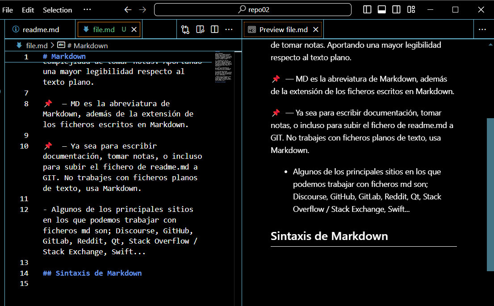

# Markdown

¿Qué es Markdown?
Markdown es un lenguaje de marcado bastante ligero que nos permite formatear textos planos de una forma muy sencilla (mediante a una serie de caracteres) añadiendo: encabezados, negritas, cursivas, listas…

📌 ️ — Markdown nace como una alternativa a HTML, ya que con HTML tomar notas es bastante engorroso. Y por tanto, con Markdown se reduce al complejidad de tomar notas. Aportando una mayor legibilidad respecto al texto plano.

📌 ️ — MD es la abreviatura de Markdown, además de la extensión de los ficheros escritos en Markdown.

📌 ️ — Ya sea para escribir documentación, tomar notas, o incluso para subir el fichero de readme.md a GIT. No trabajes con ficheros planos de texto, usa Markdown.

+ Algunos de los principales sitios en los que podemos trabajar con ficheros md son; Discourse, GitHub, GitLab, Reddit, Qt, Stack Overflow / Stack Exchange, Swift...
 
# Sintaxis de MARKDOWN
---
## Encabezados
<!-- Los encabezados se crean con el símbolo #, y el número de # determina el nivel del encabezado -->
# Encabezado 1
## Encabezado 2
### Encabezado 3
#### Encabezado 4
##### Encabezado 5
###### Encabezado 6

## Énfasis
<!-- Énfasis -->
<!-- Podemos aplicar cursiva con un * o _, y negrita con dos ** o __ -->
*Texto en cursiva* o _Texto en cursiva_
**Texto en negrita** o __Texto en negrita__
~~Texto tachado~~

## Listas 
<!-- Listas -->
<!-- Listas desordenadas con -, * o +; listas ordenadas con números seguidos de un punto -->
- Elemento de lista desordenada
- Otro elemento
1. Elemento de lista ordenada
2. Otro elemento

## Listas anidadas ordenadas, desordenadas y combinación de ambas
<!-- Listas Desordenadas Anidadas -->
<!-- Utiliza guiones para ítems de lista y añade espacios para anidar niveles -->
- Ítem nivel 1
  - Ítem nivel 2  <!-- Dos espacios antes de este guión para anidar bajo el ítem nivel 1 -->
    - Ítem nivel 3  <!-- Cuatro espacios para anidar aún más profundamente -->
      - Ítem nivel 4  <!-- Seis espacios para anidar bajo el ítem nivel 3 -->

<!-- Listas Ordenadas Anidadas -->
<!-- Números con punto para ítems ordenados, con espacios para anidar -->
1. Ítem nivel 1
   1. Ítem nivel 2  <!-- Tres espacios antes del número para anidar bajo el ítem nivel 1 -->
      1. Ítem nivel 3  <!-- Seis espacios para continuar la anidación -->
         1. Ítem nivel 4  <!-- Nueve espacios para anidar aún más profundo -->

<!-- Combinación de Listas Ordenadas y Desordenadas -->
<!-- Puedes mezclar tipos de lista anidando ordenadas bajo desordenadas y viceversa -->
- Ítem nivel 1
  1. Ítem ordenado nivel 2  <!-- Anidado ordenado bajo un ítem desordenado -->
  2. Otro ítem ordenado nivel 2
    - Ítem desordenado nivel 3  <!-- Anidado desordenado bajo un ítem ordenado -->
      1. Ítem ordenado nivel 4  <!-- Continúa anidando ordenadamente bajo un desordenado -->
- Otro ítem nivel 1


## Enlaces 
<!-- Enlaces -->
<!-- Los enlaces se insertan con el texto en corchetes y la URL en paréntesis -->
[Material markdown](https://medium.com/@davidbernalgonzalez/3-markdown-c82d88c1d222)

## Imágenes 
<!-- Imágenes -->
<!-- Similar a los enlaces, pero con un signo de exclamación al principio -->


## Citas
<!-- Citas -->
<!-- Las citas se marcan con > -->
> Esto es una cita.

## Tablas
<!-- Tablas -->
<!-- Las tablas se crean con | para columnas y - para los encabezados -->
| Encabezado 1 | Encabezado 2 |
| ------------ | ------------ |
| Texto 1      | Texto 2      |
| Texto 3      | Texto 4      |

## Línias horizontales
<!-- Líneas horizontales -->
<!-- Tres o más -, *, o _ para crear una línea divisoria -->
---

## Imágenes con enlace
<!-- existe la posibilidad de combinar imágenes y enlaces de la siguiente manera -->
[](www.google.es)

<!-- Ruta URL de la IMG + Descripción-->
[1]:https://user-images.githubusercontent.com/32896437/153675215-dff3448c-56bc-4da0-9cf1-6a394fd9c6f8.png "Pulp Fiction"
<!-- Enlace -->
[2]: https://es.wikipedia.org/wiki/Pulp_Fiction
<!-- Juntando la descrición con el resto de partes partes -->
[![ALT text][1]][2]

## Código en línia
Etiqueta HTML5: `<!DOCTYPE html>`\
Etiqueta HTML: `<html></html>`\
Etiqueta HEAD: `<head></head>`\
Etiqueta BODY: `<body></body>`

## Códigos de bloque
<!-- si queremos escribir un bloque de código hacemos englobando nuestro código entre ```-->
```
<!DOCTYPE html>
<html lang="en">
<head>
</head>
<body>
</body>
</html>
```