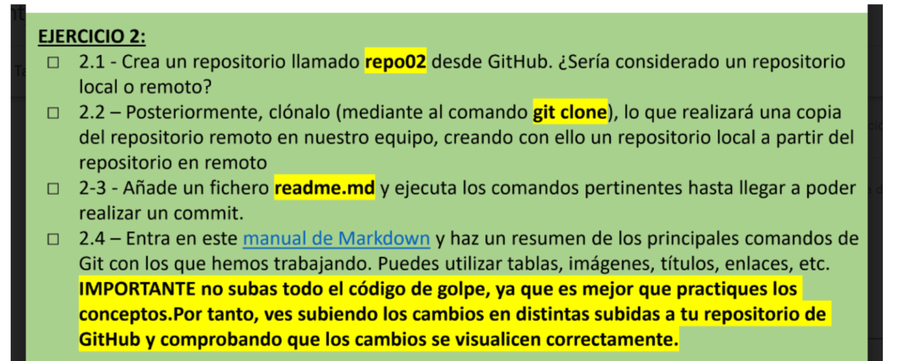
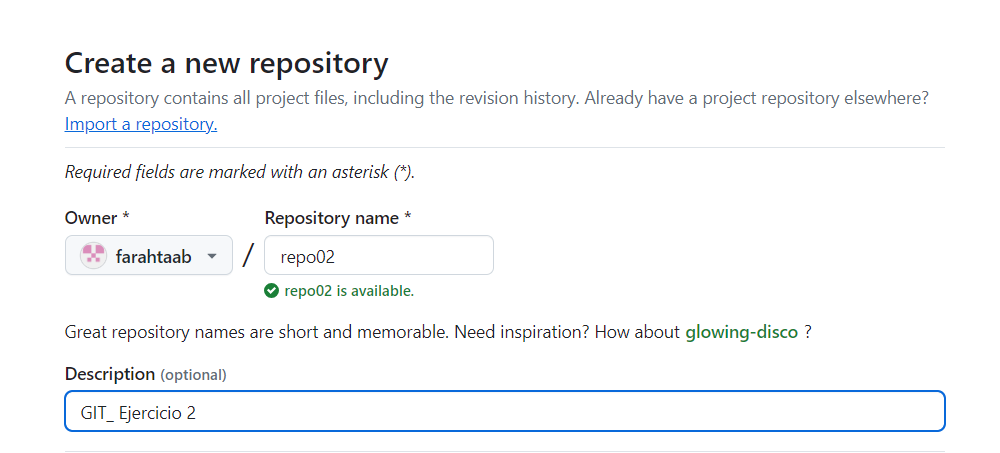
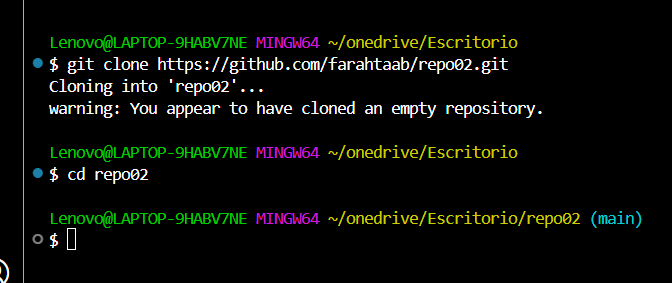
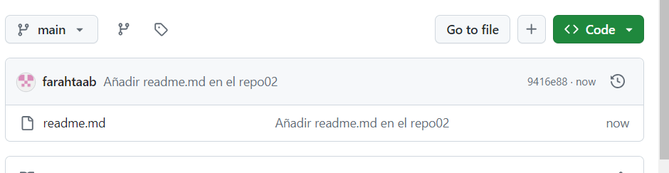
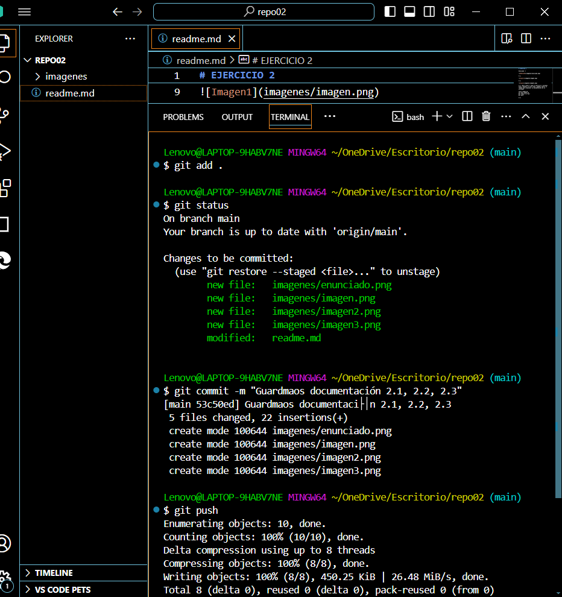
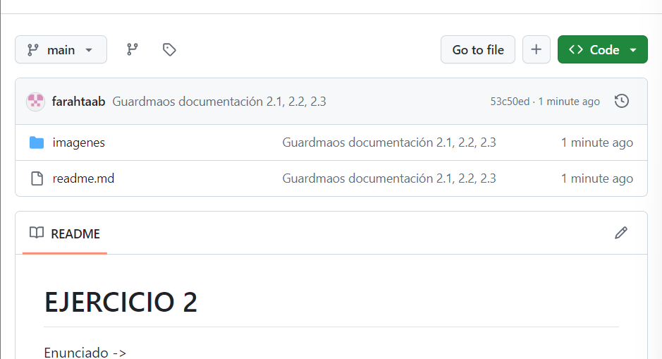

# EJERCICIO 2

Enunciado ->

2.1_ 

2.2_

2.3_ (Para llevar a cabo el ejercicio 2.3 usaremos estos comandos en este orden, podemos editar el readme para almacenar la documentación de la acividad)

* touch readme.md
* git add readme.md
* git commit -m "txt"
* git push

(COMMIT 2)

- Subimos cambios:

- Comprobamos:

2.4_ 